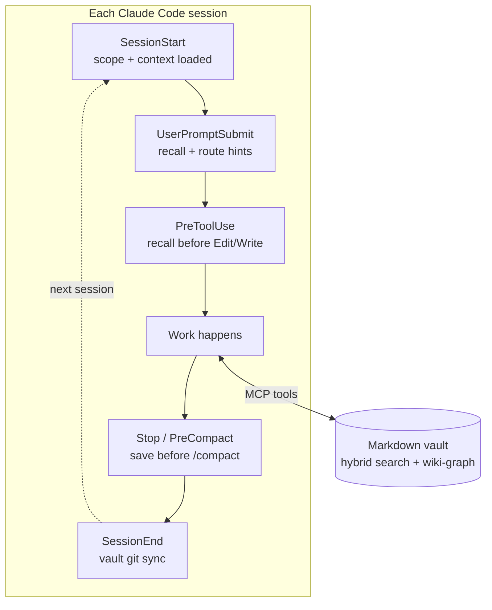

# 🧠 Symbiosis Brain

> **Stop re-explaining your project to Claude. Make it remember. Build your symbiosis.**

Persistent memory for Claude Code — a markdown brain that lives next to your code, with skills and hooks that make Claude actually use it. Local, file-based, Obsidian-compatible.

[](https://pypi.org/project/symbiosis-brain/)
[](https://pypi.org/project/symbiosis-brain/)
[](LICENSE)

---

## What changes

You stop saying *"Hi Claude, my stack is X, last week we decided Y…"* every session. Claude remembers your stack, your projects, your past decisions. Painful lessons resurface **before** you trip on them. Knowledge flows between repos. A smart hook saves the session **before** `/compact` swallows it.

<p align="center">
  
  <br>
  <em>368 notes, 431 entities, all wiki-linked — and this is just a few weeks of real work. This is what your head looks like when you're juggling five projects at once. Don't panic — Claude knows exactly where to look.</em>
</p>

## Install (30 seconds)

```bash
uv tool install symbiosis-brain
symbiosis-brain setup claude-code
```

That's it. Restart Claude Code — `brain-welcome` introduces itself, asks two friendly questions, and you're done.

<details>
<summary><b>Don't have <code>uv</code>? Or prefer installing straight from GitHub?</b></summary>

**Install `uv` first** (one-time, ~30 seconds — `uv` is a fast Python package manager):

```powershell
# Windows (PowerShell)
powershell -ExecutionPolicy ByPass -c "irm https://astral.sh/uv/install.ps1 | iex"
```
```bash
# macOS / Linux
curl -LsSf https://astral.sh/uv/install.sh | sh
```

**Install Symbiosis Brain straight from GitHub** (no PyPI involved):

```bash
uv tool install git+https://github.com/Krill113/symbiosis-brain.git
symbiosis-brain setup claude-code
```

Same result — installs the latest `main` branch directly from the repo. Useful if you want to track unreleased changes or install from a fork.

</details>

> 🤖 **Want Claude Code to install it for you?**
> Paste this prompt:
>
> > *Install Symbiosis Brain from https://github.com/Krill113/symbiosis-brain — use the default vault path, then remind me to restart Claude Code.*
>
> Claude will read this README, run the install with `--vault ~/symbiosis-brain-vault`, and tell you when it's time to restart. **You'll need to restart Claude Code manually** — the running session can't pick up its own new MCP server until you do.

> 🤝 **Augments Claude Code — never overrides it.**
> Symbiosis Brain *adds* a memory layer. Every built-in Claude Code feature keeps working. Your existing hooks, skills, slash commands, and settings stay intact — we deep-merge our config with a `.bak` backup, and `symbiosis-brain uninstall` restores everything.

---

## Why a markdown brain?

- 📂 **Your knowledge, your files.** Plain `.md` in a folder you pick. Human-readable, git-trackable, opens in Obsidian as a graph.
- 🔍 **Hybrid search, all local.** FTS5 + vector (sqlite-vec + fastembed), no API key — memory calls don't add an API bill on top of Claude.
- 🔗 **Wiki-links connect your projects.** `brain_context` walks the graph N hops — decisions in one repo surface as context in another.
- ⏰ **Bi-temporal.** Every fact has a `valid_from` / `valid_to` date. Stale knowledge gets a warning, not silent rot.
- 🗂️ **Scoped per project.** Notes are tagged to a project scope; global notes always ride along. Switch repos and Claude picks up the right context automatically — via a one-line marker in `CLAUDE.md`.
- 🪶 **Quiet by design.** No Clippy, no nag. Hooks fire only when they earn the interruption (e.g., context at 35% → "save before /compact swallows this").
- 🧩 **Skills shipped, not just storage.** `brain-init`, `brain-recall`, `brain-save`, `brain-tools` make Claude *use* the memory — not pray that it does.
- 🪝 **Hooks make it automatic.** Six session-lifecycle events are wired by the installer — recall fires before you ask, saves happen before context is lost.
- 🧭 **Tool routing.** Every prompt, a lightweight engine matches intent against a catalog of tool hints and injects `[route]` advice — so Claude reaches for the right tool (Serena for symbols, Playwright for JS-heavy pages, PowerShell on Windows) without manual prompting. `/brain-tools` onboards your own MCP servers.
- 🤝 **Layered, never invasive.** Adds capability without disabling any of Claude Code's defaults. Uninstall is one command.

## What it feels like

```text
You:    Continue from where we left off yesterday.

Claude: [brain-recall fires silently]
        I see we paused on the auth migration after deciding to
        skip JWT rotation — the blocker was the legacy refresh
        token format. Pick up there?
```

Same vault, days apart, different process. No prompt engineering, no copy-pasting context. The skill `brain-recall` fired on its own because the request triggered it.

## How it works (60 seconds)

A tiny MCP server backed by a folder of markdown notes. SQLite indexes them with FTS5 + vector search (sqlite-vec + fastembed); wiki-links form a graph; six bash hooks wire the recall/save loop into Claude Code's own session lifecycle.



**MCP tools (13):** `brain_search`, `brain_read`, `brain_write`, `brain_append`, `brain_patch`, `brain_context`, `brain_list`, `brain_status`, `brain_sync`, `brain_lint`, `brain_rename`, `brain_delete`, `brain_rotate_handoffs`.

**Skills (7):** `brain-init` (session bootstrap + scope resolution), `brain-recall` (pre-task memory search), `brain-save` (write + retrospective self-scan), `brain-tools` (tool-routing onboarding), `brain-welcome` (first-run setup), `brain-project-init` (new-project onboarding), `brain-backfill-gists` (hygiene backfill).

**Hooks (6 events, all bash):**
- `SessionStart` — scope resolution, server prewarm, MCP roster cache
- `UserPromptSubmit` — hybrid recall + tool-route hints, injected as `[memory: N hits]` / `[route]`
- `PreToolUse` — pre-action recall before Edit / Write / Task / MultiEdit
- `Stop` — context-threshold save reminder (default zones 25 / 35 / 45%)
- `PreCompact` — last-chance save before `/compact`
- `SessionEnd` — vault git sync

You write nothing manually. The vault grows as you work.

## Why this, not…

- **Plain `CLAUDE.md` / `MEMORY.md`** — they grow into a 10K-line blob with no search and no decay. Symbiosis Brain decomposes into searchable, scoped, time-stamped notes.
- **basic-memory** — closest in spirit (markdown + Obsidian). We add hybrid search (FTS5 + vector), skills/hooks that drive use, bi-temporal `valid_to`, per-project + global scope, and tool routing.
- **mem0 / Letta** — different category (cloud SaaS / agent SDK). We're local-first storage your existing Claude Code uses.
- **mcp-memory-service** — they ship REST/dashboard. We ship human-readable markdown + skills + hooks.

## Configuration

The installer seeds a behavioural env block in `~/.claude/settings.json` (non-clobbering — your existing values are preserved).

| Variable | Default | What it does |
|---|---|---|
| `SYMBIOSIS_BRAIN_VAULT` | `~/symbiosis-brain-vault` | Path to your vault folder |
| `SYMBIOSIS_BRAIN_TOOLS` | *(install path)* | Path to the installed package (for `uv run` in hooks) |
| `SYMBIOSIS_BRAIN_SCOPE` | *(auto from cwd)* | Active project scope; overridden by the `CLAUDE.md` marker |
| `SYMBIOSIS_BRAIN_SAVE_THRESHOLDS` | `25,35,45` | Context % levels that trigger save reminders |
| `SYMBIOSIS_BRAIN_SAVE_DELTA_GUARD` | `10` | Minimum % change since last save before re-triggering |
| `SYMBIOSIS_BRAIN_RECALL_ENABLED` | `true` | Toggle UserPromptSubmit memory recall |
| `SYMBIOSIS_BRAIN_RECALL_TOP_K` | `5` | Max hits returned per recall |
| `SYMBIOSIS_BRAIN_ROUTING_MODE` | `decompose` | Tool-routing output mode (splits discipline vs tool hints) |
| `SYMBIOSIS_BRAIN_RULES_ENABLED` | `true` | Toggle the periodic tool-roster reminder |

## Maintenance

```bash
symbiosis-brain doctor                       # health check
symbiosis-brain setup claude-code --repair   # fix only what's broken
symbiosis-brain uninstall                    # restore settings, vault preserved
uv tool upgrade symbiosis-brain              # update
```

## FAQ

**Is my knowledge private?** 100%. Everything is local files + a local SQLite index. No cloud, no telemetry, no API calls.

**Will this break my Claude Code setup?** No. Symbiosis Brain layers **on top of** Claude Code — it never disables built-in features, overrides your hooks, or removes your existing skills. Config is deep-merged with a `.bak` backup. `uninstall` restores everything.

**Can I open the vault in Obsidian?** Yes — that's a first-class use case. The welcome flow can install Obsidian for you and open your first note as a graph.

**Does it work with other AI agents?** Today: tuned for Claude Code. The MCP layer is portable; skill-driven UX is Claude-Code-specific but the storage works anywhere MCP works.

**What about tool routing?** Run `/brain-tools` after install to onboard your MCP servers. The default catalog covers web search, registry version lookups, Serena (symbol work), Playwright (JS-heavy pages), PowerShell (Windows shell), systematic-debugging, and code-catalog discovery. Unknown tools get one short question; you decide their trigger. Per-install routing lives in `$VAULT/tool-routing.local.json` (git-ignored, never indexed).

**What about the name?** *Symbiosis* — a mutually beneficial partnership. The tool lives next to Claude; Claude becomes more useful; your knowledge survives the next `/compact`. Build your symbiosis.

**How do I delete everything?** `symbiosis-brain uninstall` restores your `settings.json` from backup. The vault folder is preserved — delete it manually if you want a clean slate.

## Contributing

Pull requests welcome. A few rules:

- **Test fixtures must be synthetic.** Never commit a real vault snapshot, real notes, or real handoffs as a fixture — fabricate minimal structural data instead.
- **No personal data in tracked files.** No local absolute paths (`C:\Users\...`), usernames, emails, or private project names — use `sys.executable`, env vars, relative paths, and generic placeholders.
- The private vault lives **outside this repo** (sibling directory, git-ignored) — never `git add` vault content.
- Dev install: `uv tool install --editable .` then `symbiosis-brain setup claude-code`.
- Tests: `uv run pytest` (plus the bash hook tests under `tests/`).

## Release process (maintainer notes)

<details>
<summary>Maintainer release steps</summary>

Releases are auto-published to PyPI on `v*` git tags via GitHub Actions (Trusted Publisher OIDC, no API tokens).

1. `hatch version <patch|minor|major>` — bumps `src/symbiosis_brain/__init__.py`
2. Move `[Unreleased]` items in `CHANGELOG.md` into a new `[X.Y.Z] — YYYY-MM-DD` section
3. `git commit -am "release: vX.Y.Z"`
4. `git tag vX.Y.Z && git push --follow-tags`
5. Watch [Actions](https://github.com/Krill113/symbiosis-brain/actions) — `build`, `publish`, `verify` jobs must all pass
6. Verify on [pypi.org/project/symbiosis-brain](https://pypi.org/project/symbiosis-brain/)

</details>

## License

Apache 2.0. See [LICENSE](LICENSE).
