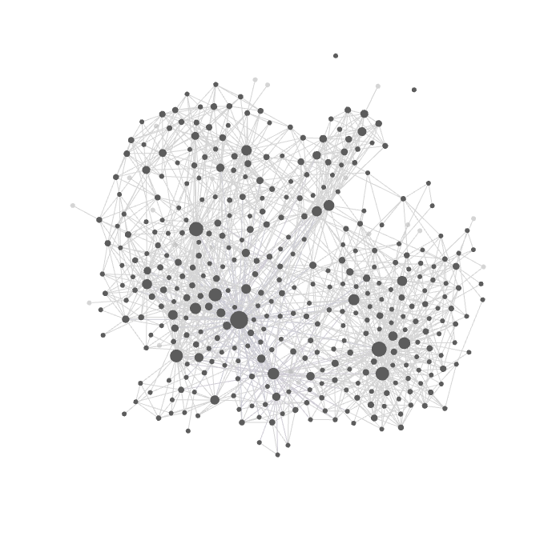

# 🧠 Symbiosis Brain

> **Stop re-explaining your project to Claude. Make it remember. Build your symbiosis.**

Persistent memory for Claude Code — a markdown brain that lives next to your code, with skills and hooks that make Claude actually use it. Local, file-based, Obsidian-compatible.

[](https://pypi.org/project/symbiosis-brain/)
[](https://pypi.org/project/symbiosis-brain/)
[](LICENSE)

---

## What changes

You stop saying *"Hi Claude, my stack is X, last week we decided Y…"* every session. Claude remembers your stack, your projects, your past decisions. Painful lessons resurface **before** you trip on them. Knowledge flows between repos. A smart hook saves the session **before** `/compact` swallows it.

<p align="center">
  
  <br>
  <em>368 notes, 431 entities, all wiki-linked — and this is just a few weeks of real work. This is what your head looks like when you're juggling five projects at once. Don't panic — Claude knows exactly where to look.</em>
</p>

## Install (30 seconds)

```bash
uv tool install symbiosis-brain
symbiosis-brain setup claude-code
```

That's it. Restart Claude Code — `brain-welcome` introduces itself, asks two friendly questions, and you're done.

<details>
<summary><b>Don't have <code>uv</code>? Or prefer installing straight from GitHub?</b></summary>

**Install `uv` first** (one-time, ~30 seconds — `uv` is a fast Python package manager):

```powershell
# Windows (PowerShell)
powershell -ExecutionPolicy ByPass -c "irm https://astral.sh/uv/install.ps1 | iex"
```
```bash
# macOS / Linux
curl -LsSf https://astral.sh/uv/install.sh | sh
```

**Install Symbiosis Brain straight from GitHub** (no PyPI involved):

```bash
uv tool install git+https://github.com/Krill113/symbiosis-brain.git
symbiosis-brain setup claude-code
```

Same result — installs the latest `main` branch directly from the repo. Useful if you want to track unreleased changes or install from a fork.

</details>

> 🤝 **Augments Claude Code — never overrides it.**
> Symbiosis Brain *adds* a memory layer. Every built-in Claude Code feature keeps working. Your existing hooks, skills, slash commands, and settings stay intact — we deep-merge our config with a `.bak` backup, and `symbiosis-brain uninstall` restores everything.

---

## Why a markdown brain?

- 📂 **Your knowledge, your files.** Plain `.md` in a folder you pick. Human-readable, git-trackable, opens in Obsidian as a graph.
- 🔍 **Hybrid search out of the box.** SQLite + FTS5 + sqlite-vec. Local, fast, no cloud, no API key, no per-token pricing.
- 🔗 **Wiki-links connect your projects.** `brain_context` walks the graph N hops — decisions in one repo surface as context in another.
- ⏰ **Bi-temporal.** Every fact has a `valid_from` / `valid_to` date. Stale knowledge gets a warning, not silent rot.
- 🪶 **Quiet by design.** No Clippy, no nag. Hooks fire only when they earn the interruption (e.g., context at 70% → "save before /compact swallows this").
- 🧩 **Skills shipped, not just storage.** `brain-init`, `brain-recall`, `brain-save`, `brain-project-init` make Claude *use* the memory — not pray that it does.
- 🤝 **Layered, never invasive.** Adds capability without disabling any of Claude Code's defaults. Uninstall is one command.

## What it feels like

```text
You:    Continue from where we left off yesterday.

Claude: [brain-recall fires silently]
        I see we paused on the auth migration after deciding to
        skip JWT rotation — the blocker was the legacy refresh
        token format. Pick up there?
```

Same vault, days apart, different process. No prompt engineering, no copy-pasting context. The skill `brain-recall` fired on its own because the request triggered it.

## How it works (60 seconds)

A tiny MCP server backed by a folder of markdown notes. SQLite indexes them with FTS5 + vector search; wiki-links form a graph; companion skills wire the recall/save loop into Claude Code's own session lifecycle (`SessionStart`, `Stop`, `PreCompact` hooks).

You write nothing manually. The vault grows as you work.

## Why this, not…

- **Plain `CLAUDE.md` / `MEMORY.md`** — they grow into a 10K-line blob with no search and no decay. Symbiosis Brain decomposes into searchable, scoped, time-stamped notes.
- **basic-memory** — closest in spirit (markdown + Obsidian). We add hybrid search (FTS5 + vector), skills/hooks that drive use, bi-temporal `valid_to`, per-project + global scope.
- **mem0 / Letta** — different category (cloud SaaS / agent SDK). We're local-first storage your existing Claude Code uses.
- **mcp-memory-service** — they ship REST/dashboard. We ship human-readable markdown + skills.

## Maintenance

```bash
symbiosis-brain doctor                       # health check
symbiosis-brain setup claude-code --repair   # fix only what's broken
symbiosis-brain uninstall                    # restore settings, vault preserved
uv tool upgrade symbiosis-brain              # update
```

## FAQ

**Is my knowledge private?** 100%. Everything is local files + a local SQLite index. No cloud, no telemetry, no API calls.

**Will this break my Claude Code setup?** No. Symbiosis Brain layers **on top of** Claude Code — it never disables built-in features, overrides your hooks, or removes your existing skills. Config is deep-merged with a `.bak` backup. `uninstall` restores everything.

**Can I open the vault in Obsidian?** Yes — that's a first-class use case. The welcome flow can install Obsidian for you and open your first note as a graph.

**Does it work with other AI agents?** Today: tuned for Claude Code. The MCP layer is portable; skill-driven UX is Claude-Code-specific but the storage works anywhere MCP works.

**What about the name?** *Symbiosis* — a mutually beneficial partnership. The tool lives next to Claude; Claude becomes more useful; your knowledge survives the next `/compact`. Build your symbiosis.

**How do I delete everything?** `symbiosis-brain uninstall` restores your `settings.json` from backup. The vault folder is preserved — delete it manually if you want a clean slate.
